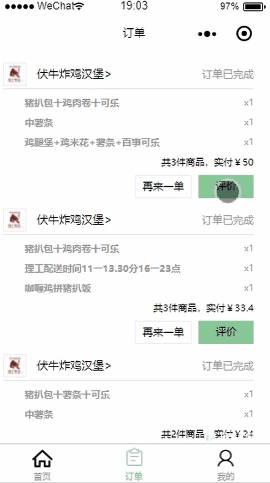

### 关于
1.一个今年年初写的毕业设计，由于之前用Vue做了一个WebAPP，所以后端很多接口直接能用（ps: 偷懒，不用再去设计数据库还有写接口了哈），所以当时马上就定了做这个课题设计，第一次写小程序，没有用任何小程序框架，希望项目能够给接下来做毕设的同学或者刚想入门小程序开发的朋友们提供一点参考。

### 效果演示
部分截图

### 关联项目地址

后端项目地址：[GitHub：https://github.com/zwStar/meituan-backend](https://github.com/zwStar/meituan-backend)

Vue版本：：[GitHub：https://github.com/zwStar/vue-meituan](https://github.com/zwStar/vue-meituan)

## 项目运行

项目运行之前，请确保系统已经安装node和mongodb应用并拉去后端项目代码（见上面），启动本地数据库，导入/db目录下的数据库到本地，运行后端项目，微信开发者工具启动本项目即可。

### 不足
1.很多详细功能没有实现，比如筛选，排序等
2.没有支付功能，由于个人接入不了微信支付，如果需要实现可通过页面跳转到其它第三方支付平台手动支付，如我另一个WebAPP版项目那样接入其它支付。
3.没有真机测试过，不知道能不能在真机跑起来。
4.第一次写小程序，而且也是截止到目前写的唯一一个小程序，可能存在很多问题。

# License
    MIT

# 打赏
如果觉得这个项目对你有帮忙，可以请我喝杯奶茶哈（有疑问也可以备注，可以马上答疑哈）

微信：

支付宝：

